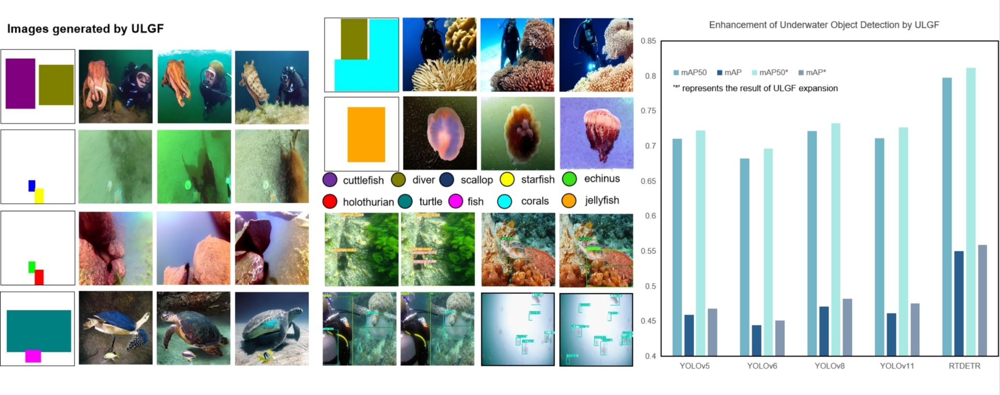

# ULGF: A Diffusion Model-Based Image Generation Framework for Underwater Object Detection
> Yaoming Zhuang,Longyu Ma, Jiaming Liu, Yonghao Xian,Baoquan Chen,Li Li, Chengdong Wu, Wei Cui, Zhanlin Liu
> 


## Installation
Clone this repo and create the ULGF environment with conda. We test the code under `python==3.7.16, pytorch==1.12.1, cuda=11.3` on RTX 3090 GPU servers. Other versions might be available as well.

### 1. Deploy Conda environment
```Command Line
conda create -n ULGF python==3.7
```

### 2. Install package dependencies
```Command Line
pip install -r requirements.txt
```

## Download Pre-trained Models
We use [Stable Diffusion V1.5](https://huggingface.co/stable-diffusion-v1-5/stable-diffusion-v1-5/tree/main) as a pre-trained model to train our model


## Quick Start

### 1. Prepare dataset
The dataset we used is provided by [RUOD](https://github.com/dlut-dimt/RUOD), and the downloaded dataset labels should be converted to the COCO format.


### 2. Train ULGF
We use a single RTX3090 to complete the training task. We hope you can reserve more than 24GB of space for training.You need to introduce different loss functions in line 34 of [train_UWLGM.py](train_UWLGM.py).
```bash
# RUOD
bash tools/dist_train.sh \
	--dataset_config_name configs/data/ruod_256x256.py \
	--output_dir work_dirs/ruod_256x256
```


### 3. Inference
ULGF supports generating diverse underwater images, and we introduce fixed random seeds in inference to ensure controllable results (which is not necessary). The weights we have trained can be downloaded [here](https://drive.google.com/drive/folders/1e5qqKFt_G_y-0izYa21KWNMFlILlCNZA?usp=drive_link).In addition, if you want to generate underwater images with custom styles, please refer to our [annotated dataset](https://drive.google.com/file/d/1M7Oy9hTfl4Dp7waSmhN0i_vqkm-pkC_k/view).You need to modify the baseline used for inference on line 81 of [generation_utils.py](utils/generation_utils.py).
```Command Line
# StableDiffusionPipeline
python run_dataset_expansion.py
# PriorDiffusionPipeline
python prior_probability_distribution/run_prior_expansion.py
```

## Evaluation Method
We mainly use mAP and FID to evaluate ULGF.
### 1. mAP
We use the [ultralytics toolbox](https://github.com/ultralytics) to test the improvement of ULGF in underwater target detection tasks and the layout accuracy of ULGF.We use the ULGF expanded dataset to train different detectors. We use the detection model trained by RUOD to verify the layout accuracy of the generated images.We provide partially trained object detection [models](https://drive.google.com/drive/folders/1E-UwfQAIZDczz1WfpYANxbqFdPzo7eKt?usp=drive_link).

```
from ultralytics import YOLO
model = YOLO("your model")  # load a custom model
metrics = model.val(data="your yaml")
```
### 2. FID
All images for testing are uniformly scaled to a size of 256. The relevant dataset can be viewed [here](https://drive.google.com/drive/folders/1bxBnTpBpk5w94jQLxEF_vXHbPFKSVWZ-?usp=drive_link).
```Command Line
python tools/FIDValue.py
```


## Citation
Announce later


## Acknowledgement
We adopt the following open-sourced projects:
- [diffusers](https://github.com/huggingface/diffusers/): basic codebase to train Stable Diffusion models.
- [GeoDiffusion](https://github.com/KaiChen1998/GeoDiffusion): Training layout guided diffusion model
- [SCP-Diff](https://air-discover.github.io/SCP-Diff/) Prior information extraction